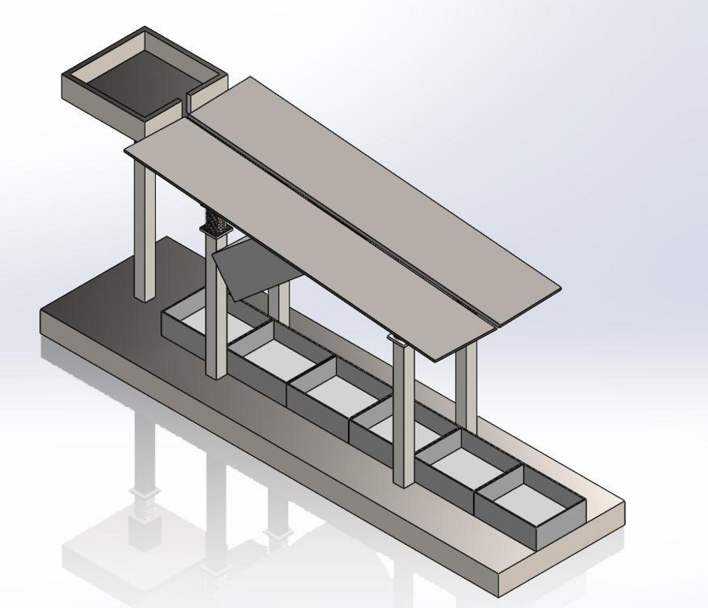
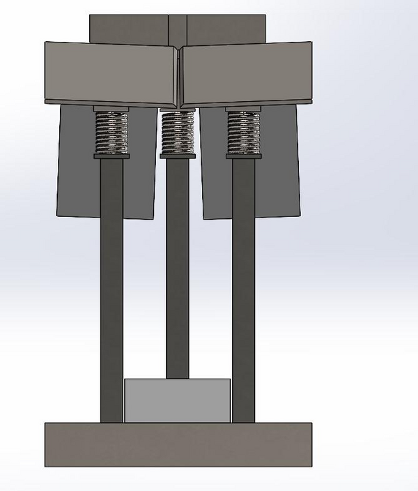
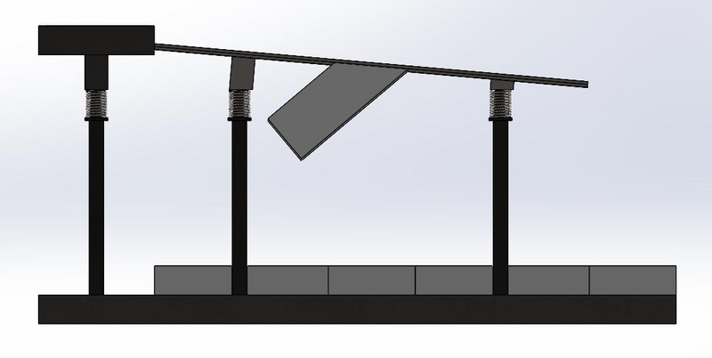
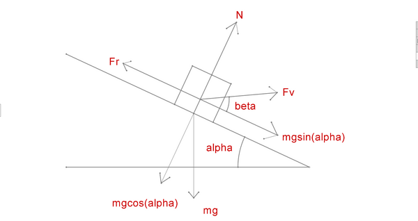

# Bolt Sorting Machine (Vibration Mechanism)

**Design of Machine Elements course project, BITS Pilani** · Team of 8 · My role: **built the complete CAD assembly and simulated its operation** · Aug – Nov 2024

## Problem

Sorting mixed bolts by hand is slow and error-prone. This machine sorts them by size with a vibrating, declining ramp.

## How it works

Bolts are fed at the top of a ramp inclined at 5°. A vibration motor shakes the ramp so bolts move down. The gap between the two plates widens linearly from 21 mm to 36 mm, so each bolt drops through when the gap matches its size. Five collecting boxes catch bolts below M16, M16, M18, M20, M22, and above M22.

| Front | Side |
|---|---|
|  |  |

## Engineering highlights (from the [design report](docs/design-report.pdf))

- **Friction check:** static friction coefficient 0.74 vs 0.08 needed, so bolts stay put until vibration is applied.
- **Vibration and motor sizing:** 50 Hz, 0.5 mm amplitude gives 49.3 m/s² peak acceleration. Required power about 8.4 W; with a 1.25 safety factor, a 10 W variable-speed vibration motor was selected.
- **Structure:** force and moment balance on the support columns; compressive stress check on 25.4 mm square hollow beams.
- **Wear:** Archard's equation estimates about 0.026 mm/year plate wear for SS304 at 8 h/day.
- **Spring design:** music wire (A228) springs sized by Shigley's method with a 1.5 safety factor, comparing wire diameters on cost.

## Files

- `cad/` — SolidWorks parts, assembly and drawing (`DME Assembly.SLDASM`)
- `docs/design-report.pdf` — full calculations
- `media/` — screen recordings of the CAD model
- `images/drawing.png` — drawing sheet

**Tools:** SolidWorks · **Skills:** machine design, mechanism design, motor sizing, spring design, team CAD ownership
