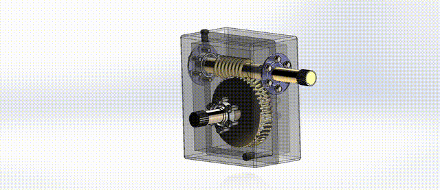

# Neck Exoskeleton — Product Design

**Research project, BITS Pilani** · Solo, under a research associate · Jan – May 2025

A wearable neck exoskeleton that gives ergonomic support to the head and neck.

## Design iterations

1. **Concept 1** (`cad/concept-1/`) — string-and-pulley support with a stopper.
2. **Concept 2** (`cad/concept-2-spring-pulley/`) — extension-spring system with a pulley in a compact box.
3. **Final draft** (`cad/final-worm-gear/`) — spring mechanism plus a worm-gear reducer (worm, worm wheel, shaft, casing, flanges) for a self-locking, adjustable clutch.

## Calculations

`calculations/spring-and-clutch-calculations.xlsx` sweeps extension-spring wire diameter (1.55–3.3 mm) and computes, for each:
mean coil diameter, spring index, active coils, ultimate and shear strength (music wire, A = 2211 MPa·mm^m, m = 0.145), Bergsträsser factor, spring rate and maximum deflection at head angles of 0°, 15°, 30°, 45° and 60°.

The spring loads come from neck loads of 53–267 N across 0–60° of head flexion; 2.3 mm music wire was selected for the initial prototype. My main task was the worm-gear clutch that engages and releases the elastic support. I also ran user trials, assessed by doctors, and collected the subject data.

## Files

- `cad/` — SolidWorks parts and assemblies for each iteration
- `media/worm-gear-reducer.mp4` — exploded and assembled animation

**Tools:** SolidWorks, Excel · **Skills:** product design, ergonomics, spring design, gear mechanisms, design iteration
