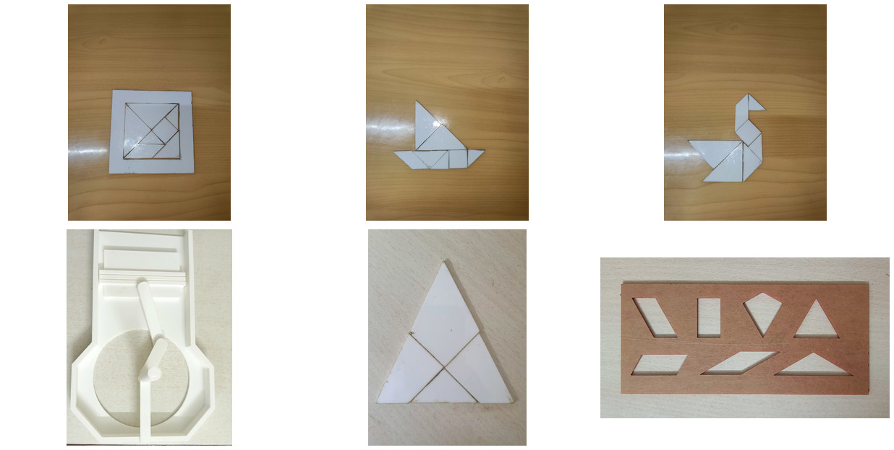
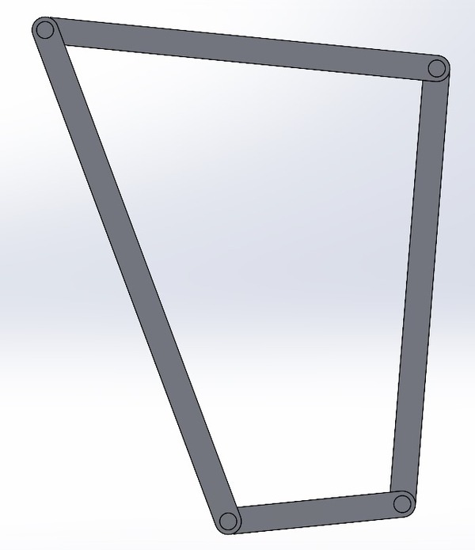

# Educational Science Kit

**Lab Oriented Project, BITS Pilani** · Supervisor: Prof. Varinder Singh · Team of 3 · Aug – Dec 2024

Hands-on teaching models and puzzles that make geometry, physics and mechanisms easier to understand, made with laser cutting and 3D printing.

## What we built

- **Laser-cut puzzles** (`laser-cutting/`): tangram and dissection puzzles and a shape-matching board, drawn in AutoCAD and cut on a CNC laser cutter (DXF/DWG files included).
- **Engine model** (`engine-model/`): a crank-slider (piston, piston arm, crank, crankshaft, crankcase) modelled in SolidWorks, with an interference check, and 3D printed. The `stl/` files preview directly on GitHub.
- **Four-bar linkage** (`four-bar-linkage/`): SolidWorks assembly for demonstrating linkage motion.
- Demonstration models of a cam-follower, gears and a differential.

## Files

- `docs/lop-report.pdf` — project report with photos of the finished kit
- `laser-cutting/`, `engine-model/`, `four-bar-linkage/` — design files

**Tools:** AutoCAD, SolidWorks, LaserCAD, 3D printing · **Skills:** design for manufacture, rapid prototyping, mechanism design
