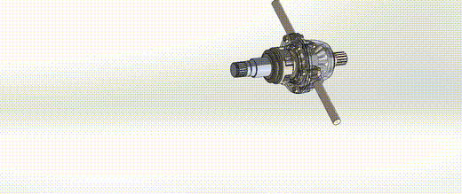

# Differential Gearbox

SolidWorks assembly of an automotive differential (7 parts) with a motion study.

## Files

- `cad/Final_Differential Gear Box.SLDASM` and parts
- `media/animation-1.mp4`, `media/animation-2.mp4` — motion study renders

**Skills:** gear assembly modelling, mates, motion studies, rendering
